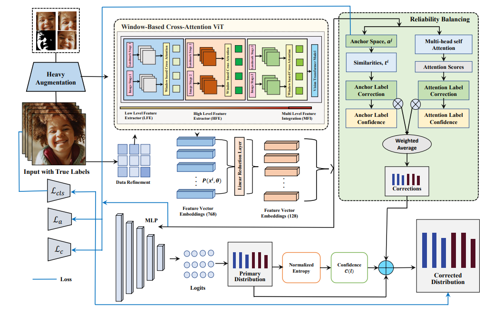
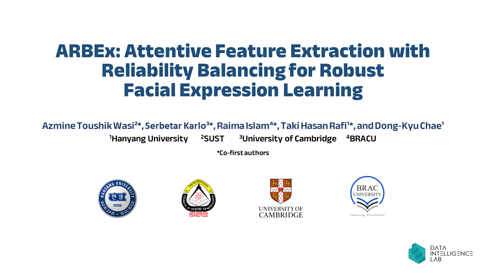

## [ARBEx: Attentive Feature Extraction with Reliability Balancing for Robust Facial Expression Learning](https://arxiv.org/abs/2305.01486)
### [Azmine Toushik Wasi](https://azminewasi.github.io/)\*, [Karlo Serbetar](https://www.linkedin.com/in/%C5%A1ekarlo/)\*, [Raima Islam](https://www.linkedin.com/in/raima-islam-310567206/)\*, [Taki Hasan Rafi](https://takihasan.github.io/)\*, and [Dong-Kyu Chae](https://dkchae.github.io/)


---
#### Our model has scored State-of-the-Art performances in multiple datasets as per [Papers with Code](https://paperswithcode.com/paper/arbex-attentive-feature-extraction-with).
- RAF-DB : [](https://paperswithcode.com/sota/facial-expression-recognition-on-raf-db?p=arbex-attentive-feature-extraction-with)
- FER+ : [](https://paperswithcode.com/sota/facial-expression-recognition-on-fer-1?p=arbex-attentive-feature-extraction-with)
- JAFFE: [](https://paperswithcode.com/sota/facial-expression-recognition-on-jaffe?p=arbex-attentive-feature-extraction-with)
---

## Architecture
 Pipeline of ARBEx.
<p align="center">
  
</p>

## Setup and run
Put pretrained `ir50.pth` and `mobilefacenet.pth` into `arbex/models/pretrained`.
By default, data is assumed to be in `../../_DATA`. The code assumes `AffWild2` as the default dataset here. If you intend to use other datasets, you may need to make certain changes in the data loading process, in `arbex/data.py`.
To change the default paths, change `DIR_IMG`, `DIR_ANN_TRAIN`, `DIR_ANN_DEV` in `arbex/config.py`
To install the dependencies run:
```
pip install -r requirements.txt
```
To run the training script:
```
python train.py
```

## Working Principle
[](https://youtu.be/I4HxYUhVd18)

## Citation
```
@misc{wasi2023arbex,
      title={ARBEx: Attentive Feature Extraction with Reliability Balancing for Robust Facial Expression Learning}, 
      author={Azmine Toushik Wasi and Karlo Šerbetar and Raima Islam and Taki Hasan Rafi and Dong-Kyu Chae},
      year={2023},
      eprint={2305.01486},
      archivePrefix={arXiv},
      primaryClass={cs.CV}
}
```

## References
[POSTER_V2](https://github.com/talented-q/poster_v2) \
[ViT](https://github.com/huggingface/pytorch-image-models)
